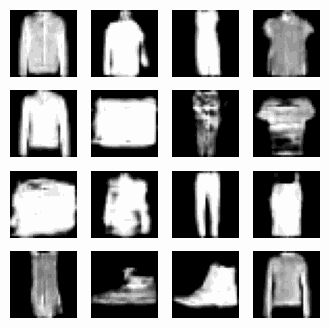

# GAN for FashionMNIST

This repository contains code for training a Generative Adversarial Network (GAN) to generate images of clothing items from the Fashion-MNIST dataset.

The GAN consists of two neural networks: a generator and a discriminator. The generator takes a random noise vector as input and outputs an image. The discriminator takes an image as input and outputs a probability that the image is real or fake.

The generator is trained to generate images that are indistinguishable from real images. The discriminator is trained to distinguish between real and fake images.

The GAN is trained using a process called adversarial training. In adversarial training, the generator and discriminator are trained simultaneously. The generator is trying to fool the discriminator, while the discriminator is trying to correctly classify images as real or fake.

The GAN is trained for a fixed number of epochs. After each epoch, the generator and discriminator are evaluated on the test set.

The code in this repository is written in Python and uses the Tensorflow backend.

